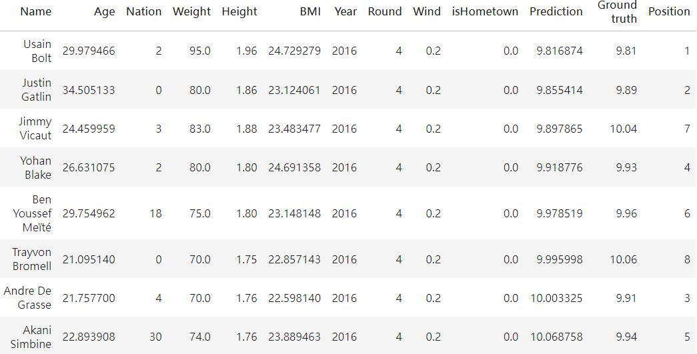
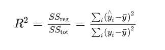
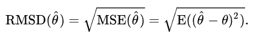
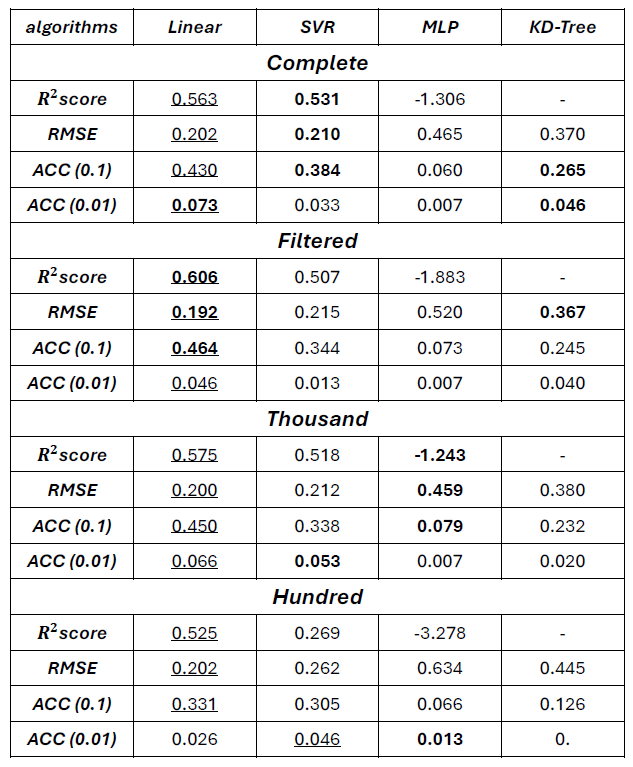
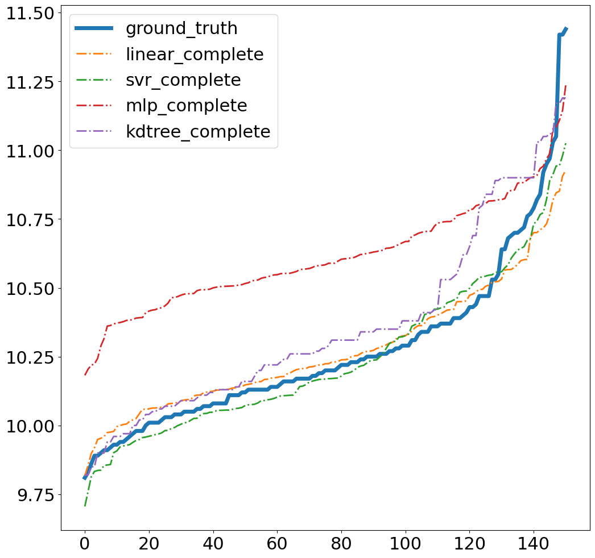
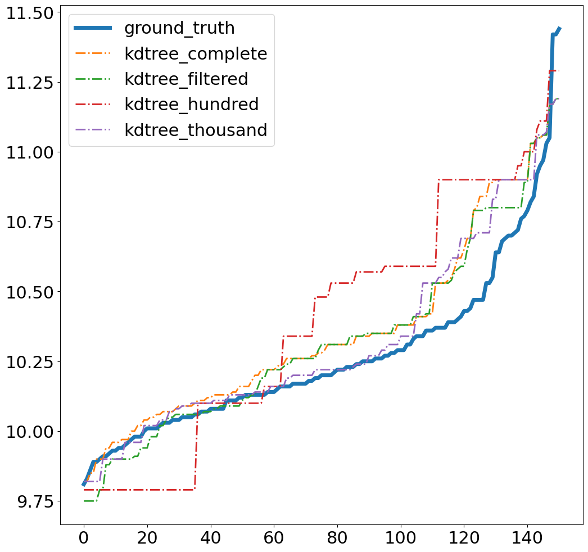
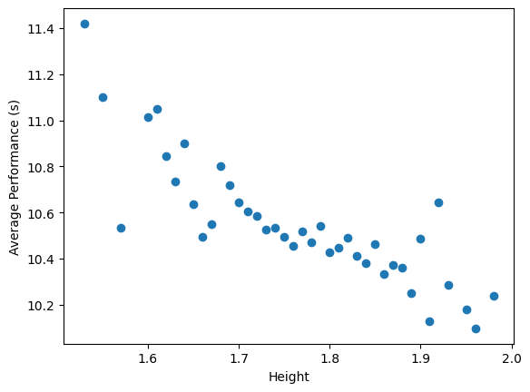
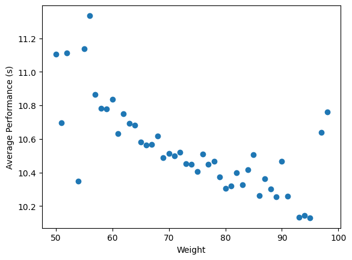
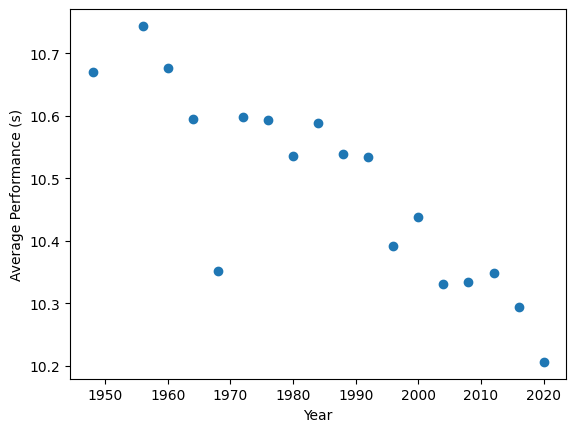
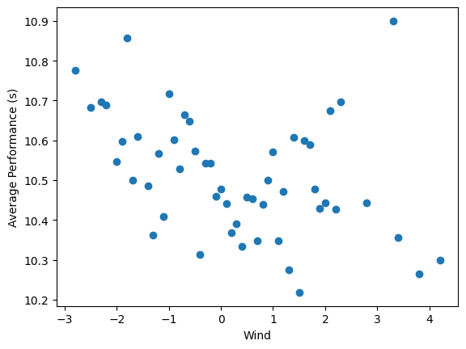

# Create my own dataset
***Goal: Use the dataset to predict the result of the men's 100 meter games in Olympic***

**Successlly predicting the top two places in the final games in 2016 RIO Olympic Men's 100 Meter**

*more detail in the* [***report***](https://github.com/ailuropodaWu/NYCU-AI-Capstone/blob/main/Project1/report/110550014_project1.pdf)
## About dataset
This is a dataset on the men’s 100 meters events in the Olympics from 1948 to 2020 (without 1952 since there is no wind information from that year).

### Attributes
The attributes in this dataset correspond to the information about athletes and other relevant details about the events. The label of the dataset represents the performance of each athlete in a competition.
Each row represents a record with following attributes about a competitor in a single game. And here is the list of attributes:
- ***Name***: <ins>string</ins>, name of the competitor, unuseful feature
- ***Nation***: <ins>int</ins>, code of the nation where the competitor from according to the dictionary you can see at [***generate_train_data.ipynb***](https://github.com/ailuropodaWu/NYCU-AI-Capstone/blob/main/Project1/generate_train_data.ipynb)
- ***Weight*** *(kg)*: <ins>float</ins>, weight of the competitor
- ***Height*** *(m)*: <ins>float</ins>, height of the competitor
- ***BMI***: <ins>float</ins>, calculated by the formula $\dfrac{Height(n)^2}{Weight(kg)}$
- ***Age***: <ins>float</ins>, age of the competitor, calculated from the birthday to the first day the event start
- ***Year***: <ins>int</ins>, the year of the event
- ***Round***: <ins>int</ins>, round in the competition, range from 1-4(4 means final)
- ***Wind*** *(m/s)*: <ins>float</ins>, wind information of the game
- ***isHometown***: <ins>bool</ins>, whether the venue of the event is the hometown of the competitor or not
- ***Label*** *(s)*: <ins>float</ins>, performance of the competitor in the game

### Web scraping
I scraped all data on the website contains historical record of men's 100 meter events [***Olympedia***](https://www.olympedia.org/event_names/40).
### Data processing
**Data preprocess**
1. Transfer any data with *null* value to match the format of the other values in the same columns
2. Extract information from the raw data, e.g. *Weight* and *Height* from *Body*
3. Drop some useless attributes

**Data process**
1. Process data from the origin form into a specific format
2. Create *Age*, *isHometown*, *BMI* extended from the original comlumns

### Referrence
[***Olympedia*** (https://www.olympedia.org)](https://www.olympedia.org)

## Algoritms
Use ***scikit-learn*** library to perform all following algorithms.

*more detail in* [***algorithm.ipynb***](https://github.com/ailuropodaWu/NYCU-AI-Capstone/blob/main/Project1/algorithm.ipynb)
### Supervised learning
- Closed-form linear regression
- SVM regressor
- MLP regressor
### Unsupervised learning
- KD-Tree

## Experiment
### Data split
- Training data: 1948 - 2008
- Testing data : 2016 & 2020
### Setting
I conducted several experiments using different training datasets to explore the effects of data quantity and quality, and compare the performance of the algorithms.

Four types of training dataset:
- Complete *(1939 data)*: the whole dataset
- Filtered *(1088 data)*: each athlete from a specific year is recorded only once with best performance in that year
- Thousand *(999 data)*
- Hundred *(100 data)*

### Evaluation metrics
- $R^2$ ***score***: 

    

- ***RMSE*** *(RMSD)*: 

    

- ***Accuracy***: the accuracy rate under a specific error

### Result
**Result table**  
    <ins>num</ins>: best under the same training data 
    **num**: best under the same algorithm

**Visualization**   

    
*Closed-form linear regression* and *SVM regressor* approximate the ground truth the most closely

The predictions become more discrete when the amount of data decreases. This is due to the reduced number of neighbors in the training data available for prediction.

### Discussion
- Deep-learning based method showed the poorest performance. I think this because of the size of training data is insufficient to train the network.
- I am suprised about the outperformance of closed-form linear regression. So I performed some feature engineering and discovered that most features are highly correlated with the label.

## Conclusion
Sports is an interesting and scientific field that is suitable for research. However, as seen in the results, the performance of the algorithms is still not optimal. In the future, we could explore other methods for data collection to create a stronger dataset or conduct further research on feature engineering to better understand the relationship between the data and the label.

## Reference
- https://www.olympedia.org/event_names/40
- https://zhuanlan.zhihu.com/p/67706712
- https://en.wikipedia.org/wiki/Root-mean-square_deviation